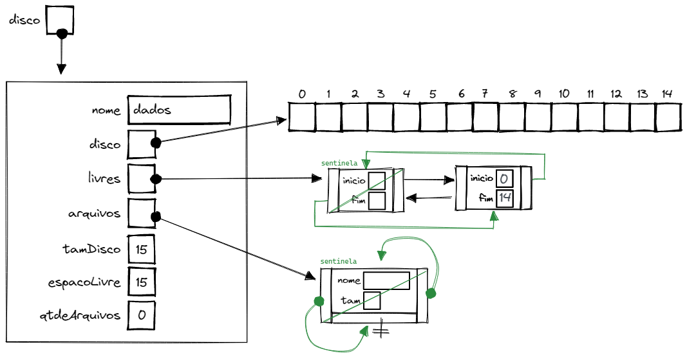
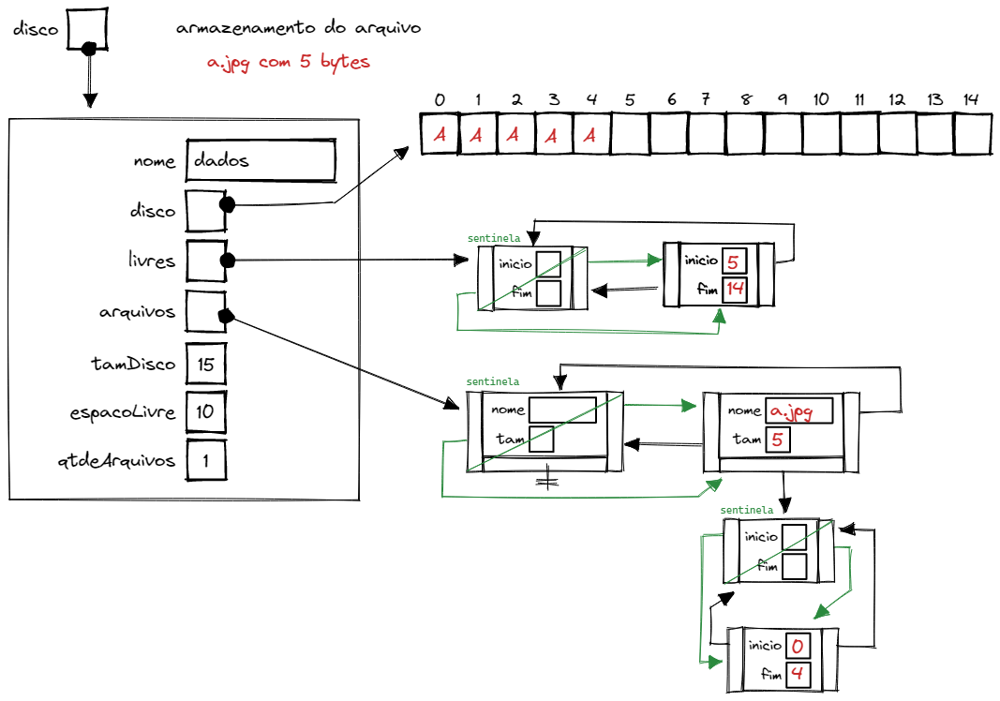
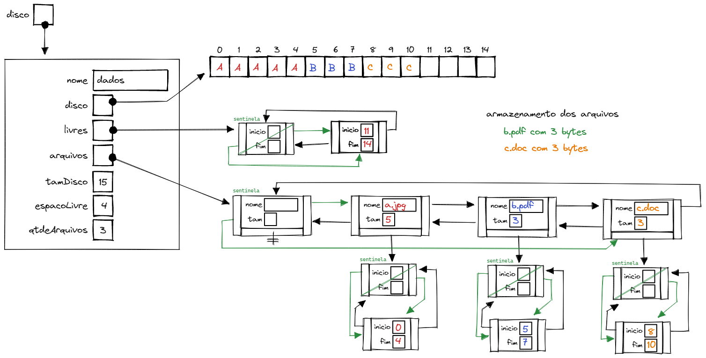
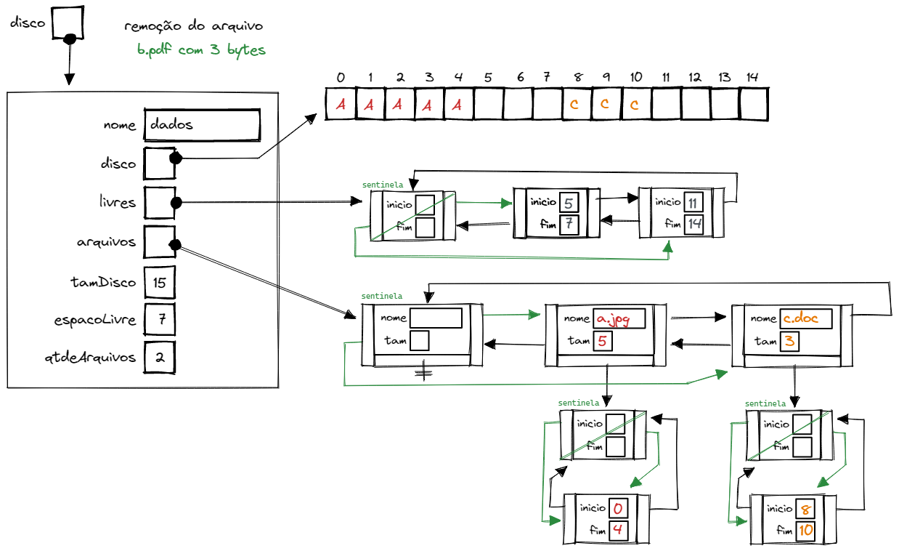
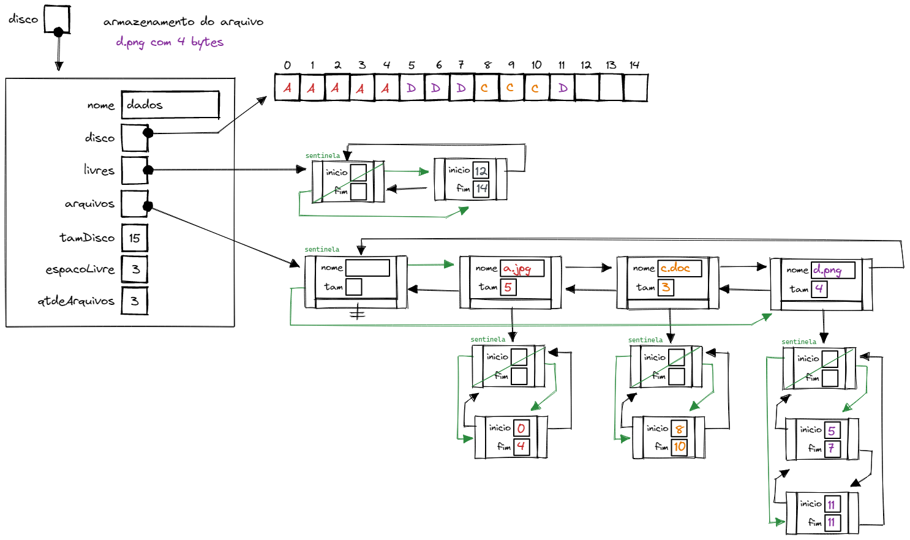

# Projeto para disciplina de Algoritmos e Estruturas de Dados I
Prof. Rafael Liberato.   
Curso Bacharelado em Ciências da Computação na UTFPR de Campo Mourão.     
Feito por **Ruan C. S. Azevedo**, **Alexandre Nassar de Peder**, **Nicole Poli Gasparello** e **Luiz Corumba**.


# Ilustração do funcionameno do programa
Feito por Prof. **Rafael Liberato**

Seguem alguns exemplos do comportamento esperado para o gerenciador.

## Criando o gerenciador

```c
	Disco* disco = disco_cria("dados", 15);
```



## Armazenando arquivos

Depois de ter criado o disco, vamos armazenar um arquivo. 

**Neste exemplo, o arquivo se chama “`a.jpg`” e está no mesmo diretório do arquivo executável.**

```c
disco_grava(disco, "./arquivos/a.jpg"); // nome arquivo deve conter o caminho absoluto ou relativo do arquivo
```



## Armazenando mais arquivos

Vamos armazenar mais dois arquivos. Ambos estão no mesmo diretório do arquivo executável.

```c
disco_grava(disco, "b.pdf"); 
disco_grava(disco, "c.doc"); 
```



## Removendo um arquivo

Vamos remover o arquivo `b.pdf`. Veja que a remoção do arquivo gerou um espaço vazio entre os arquivos a.jpg e c.doc. 

```c
disco_remove(disco, "b.pdf");
```



## Armazenando um arquivo fragmentado

Agora vamos inserir o arquivo d.png de 4 bytes. Como não há espaço suficiente para armazenar todo o conteúdo de forma contígua, o arquivo será fragmentado em 2 partes.

```c
disco_grava(disco, "d.png"); 
```



## Listando os arquivos

A função deve copiar a lista de arquivos armazenados no disco para o endereço `str` passado por parâmetro.

```c
char str[300];
disco_lista(disco, str);
printf("%s", str);
```

## Recuperando um arquivo

A recuperação do arquivo no disco deve acontecer mesmo se ele estiver fragmentado. A função deve criar uma cópia no local indicado pelo parâmetro “arquivoDestino”.

Veja o exemplo da recuperação do arquivo “d.png”. 

```c
disco_recupera(disco, "d.png", "foto.png");
```

Neste exemplo, recuperamos o arquivo `d.png` criando uma cópia com o nome `foto.png` no endereço `./temp/foto.png`. Após a recuperação, devemos ser capazes de visualizar o arquivo `foto.png` copiado na pasta `./temp`.

## Código exemplo completo

```c
Disco* disco = disco_cria("dados", 15);

disco_grava(disco, "a.jpg"); // nome arquivo deve conter o caminho absoluto ou relativo do arquivo
disco_grava(disco, "b.pdf"); 
disco_grava(disco, "c.doc"); 

disco_remove(disco, "b.pdf");

disco_grava(disco, "d.png"); 

char str[300];
disco_lista(disco, str);
printf("%s", str);

disco_recupera(disco, "d.png", "foto.png");
```


